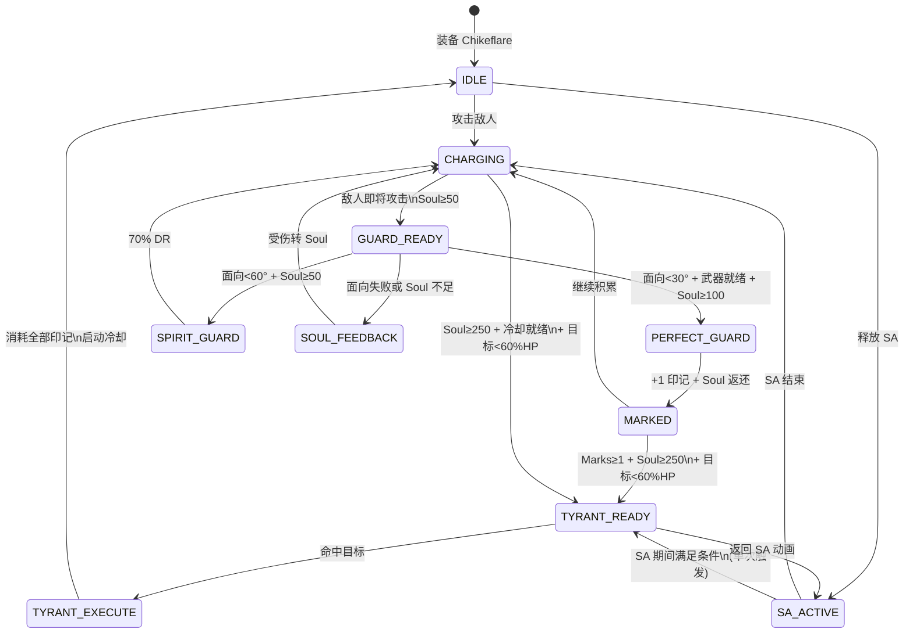

# 奇克芙蕾雅 (Chikeflare) 反击机制与暴君打击重设计方案

> **版本**: v2.0 重设计草案 | **日期**: 2026-06-25 | **状态**: 设计阶段
>
> 本文档为奇克芙蕾雅的两大核心特殊效果——SoulShield（灵魂屏障）与 TyrantStrike（暴君打击）——的完整重设计方案。不涉及 Java 代码修改，仅提供设计蓝图供后续实现参考。

---

## 目录

1. [概述与设计哲学](#1-概述与设计哲学)
2. [SoulShield 反击机制重设计](#2-soulshield-反击机制重设计)
3. [TyrantStrike 暴君打击重设计](#3-tyrantstrike-暴君打击重设计)
4. [技能互动体系](#4-技能互动体系)
5. [SA（WingToTheFuture）与新机制的协作规则](#5-sawingtothefuture-与新机制的协作规则)
6. [数值平衡表](#6-数值平衡表)
7. [战斗决策分析](#7-战斗决策分析)
8. [实现注意事项与潜在风险](#8-实现注意事项与潜在风险)

---

## 1. 概述与设计哲学

### 1.1 当前问题诊断

| #   | 问题                                            | 根因                     | 严重程度 |
| --- | ----------------------------------------------- | ------------------------ | -------- |
| 1   | SoulShield 5%~95% 概率被动触发，零冷却          | 纯随机、无操作门槛       | 🔴 致命  |
| 2   | 锁伤上限 5 点，配合高概率几乎永久免疫伤害       | 硬锁伤无递减             | 🔴 致命  |
| 3   | TyrantStrike 每次命中触发，SA 96 剑叠加 2400%HP | 无冷却、无条件、无消耗   | 🔴 致命  |
| 4   | 25% 最大生命值无上下限                          | 对 Boss/低血量目标均失控 | 🔴 致命  |
| 5   | 两个 SE 互相独立，无资源制约                    | 策略深度为零             | 🟡 中等  |
| 6   | Soul 充能只有消耗通道、缺乏主动充能手段         | 能量系统被动化           | 🟡 中等  |

### 1.2 设计哲学

新设计遵循三条核心原则：

1. **从"被动运气"到"主动判断"**：用方向判定 + 格挡时点替代概率随机，让玩家技能决定结果
2. **从"独立触发"到"循环联动"**：SoulShield 为 TyrantStrike 提供资源（暴君印记），TyrantStrike 消耗资源完成终结——形成「格挡→充能→释放」闭环
3. **从"无条件碾压"到"有限制的强力"**：添加冷却、消耗、阈值条件，保留高爆发上限但需要策略铺垫

### 1.3 设计目标量化

| 指标                       | 当前值           | 目标值                      |
| -------------------------- | ---------------- | --------------------------- |
| 有效无敌覆盖率             | ~95%（满 Soul）  | ~15-25%（取决于玩家技能）   |
| TyrantStrike SA 期间总伤害 | ~2400% HP        | ~18% HP（单次触发）         |
| 技能操作需求               | 无（自动触发）   | 高（方向判断 + 时点选择）   |
| SE 间联动深度              | 0（独立）        | 3 层（印记→消耗→冷却减免）  |
| 新手容错率                 | 极高（5 点锁伤） | 中等（动态减伤 + 充能补偿） |

---

## 2. SoulShield 反击机制重设计

### 2.1 核心变更总览

```
旧机制                              →    新机制
─────────────────────────────────────────────────────
概率判定 (5%-95% random)           →    方向判定 (面向角度 + 武器就绪状态)
无冷却                             →    12 秒共享冷却
消耗 5% 当前 Soul                   →    固定消耗 (50/30/0) + 奖励返还
单一级别 (成功/失败)                →    三阶分级 (完美/灵力/魂响)
硬锁伤 5 点                         →    动态减伤 + 吸收护盾
被动充能 (仅受伤时)                 →    主动充能 + 受伤充能双通道
```

### 2.2 三阶反击体系

#### 2.2.1 判定流程

```
                     ┌──────────────────┐
                     │ LivingAttackEvent │
                     │ (玩家受到攻击)     │
                     └────────┬─────────┘
                              │
                     ┌────────▼─────────┐
                     │ 持有 Chikeflare？  │──否──▶ 正常受伤
                     │ 拥有 SoulShield？  │
                     └────────┬─────────┘
                              │是
                     ┌────────▼─────────┐
                     │ 冷却已就绪？       │──否──▶ Soul Feedback (2.2.4)
                     │ (上次格挡后 ≥12s)  │
                     └────────┬─────────┘
                              │是
                     ┌────────▼─────────┐
                     │ 面向攻击者 ≤30°？  │──是──▶ 且武器就绪 + Soul≥100
                     │ (dot > 0.866)    │         └──是──▶ Perfect Guard (2.2.2)
                     └────────┬─────────┘         └──否──▶ Spirit Guard (2.2.3)
                              │否
                     ┌────────▼─────────┐
                     │ 面向攻击者 ≤60°？  │──是──▶ 且 Soul≥50
                     │ (dot > 0.5)      │         └──是──▶ Spirit Guard (2.2.3)
                     └────────┬─────────┘         └──否──▶ Soul Feedback (2.2.4)
                              │否
                              ▼
                     Soul Feedback (2.2.4)
```

**面向判定公式**：

```
dot = (playerLookVec · directionToAttacker)
方向向量 = normalize(attackerPos - playerEyePos)
面向阈值:
  Perfect: dot > cos(30°) ≈ 0.866  → 60° 锥角
  Spirit:  dot > cos(60°) ≈ 0.5    → 120° 锥角
```

**武器就绪状态判定**：

```
isWeaponReady = player.getAttackStrengthScale(0.0f) >= 1.0f
// 即攻击冷却完全恢复，玩家未处于挥砍动作中
// 等价于"玩家在观察敌人而非盲目攻击"
```

#### 2.2.2 完美格挡 (Perfect Guard) —「复仇之盾」

> _在最后一刻转身面对攻击，以意志铸就不破之盾。_

| 属性          | 值                                                 | 说明                           |
| ------------- | -------------------------------------------------- | ------------------------------ |
| **触发条件**  | 面向≤30° + 武器就绪 + Soul≥100 + 冷却就绪          | 最严格的时机要求               |
| **Soul 消耗** | 50（固定）                                         | 先消耗，成功后返还             |
| **Soul 返还** | +100（净收益 +50）                                 | 成功奖励，鼓励主动格挡         |
| **伤害处理**  | 完全抵消 (`event.setCanceled(true)`)               | 无伤                           |
| **反击伤害**  | `0.3 × consumedSoul = 15.0` (基础)                 | 青色拔刀剑气，`dimension` 类型 |
| **吸收护盾**  | `min(currentAbsorption + damageNegated, 20)`       | 上限 20 点                     |
| **暴君印记**  | **+1** (最大 5 层)                                 | 核心联动资源                   |
| **冷却触发**  | 12 秒                                              | 与 Spirit Guard 共享冷却       |
| **视觉效果**  | 金色冲击波 + 清脆金属音 + "PERFECT GUARD" 浮动文字 | 强反馈                         |
| **音效**      | `SoundEvents.ANVIL_LAND` (音高 1.5)                | 清脆响亮                       |

#### 2.2.3 灵力格挡 (Spirit Guard) —「灵壁」

> _灵力自动护主，虽不完美，亦可化解大半杀机。_

| 属性          | 值                                           | 说明                      |
| ------------- | -------------------------------------------- | ------------------------- |
| **触发条件**  | 面向≤60° + Soul≥50 + 冷却就绪                | 中等门槛                  |
| **Soul 消耗** | 30（固定，不返还）                           | 净消耗                    |
| **伤害处理**  | 减免 70% (`event.setAmount(original × 0.3)`) | 部分穿透                  |
| **反击伤害**  | `0.15 × consumedSoul = 4.5` (基础)           | 弱化剑气                  |
| **吸收护盾**  | `min(currentAbsorption + 原伤害 × 0.5, 15)`  | 上限 15                   |
| **暴君印记**  | 不产生                                       | 低风险、低回报            |
| **冷却触发**  | 12 秒                                        | 与 Perfect Guard 共享冷却 |
| **视觉效果**  | 淡青色波纹 + 低音金属音                      | 中等反馈                  |

#### 2.2.4 魂响反馈 (Soul Feedback) — 被动容错

> _屏障未启，但灵魂铭记伤痛，转化为下一次反击的力量。_

当玩家不满足 Perfect/Spirit Guard 条件（冷却中、面向不对、Soul 不足、或纯粹未来得及反应）时自动触发。

| 属性          | 值                                              | 说明          |
| ------------- | ----------------------------------------------- | ------------- |
| **触发条件**  | 自动（无条件）                                  | 保底机制      |
| **Soul 消耗** | 0                                               | 无消耗        |
| **Soul 充能** | `ceil(原始伤害 × 0.5)`                          | 受伤转化 Soul |
| **伤害处理**  | `min(原始伤害 × (1.0 - chargeRatio × 0.4), 12)` | 动态减伤      |
| **暴君印记**  | 不产生                                          | —             |
| **冷却**      | 不影响格挡冷却                                  | 独立          |

**动态减伤计算示例**：

| Soul 充能比例 | 减伤倍率 | 100 伤害→ | 30 伤害→ | 8 伤害→ |
| :-----------: | :------: | :-------: | :------: | :-----: |
|      0%       |  ×1.00   | 12 (cap)  | 12 (cap) |    8    |
|      25%      |  ×0.90   | 12 (cap)  | 12 (cap) |   7.2   |
|      50%      |  ×0.80   | 12 (cap)  | 12 (cap) |   6.4   |
|      75%      |  ×0.70   | 12 (cap)  | 12 (cap) |   5.6   |
|     100%      |  ×0.60   | 12 (cap)  | 12 (cap) |   4.8   |

> **设计理由**：与旧的硬锁 5 点不同，动态减伤在 Soul 高时有更好的保护，但始终保留 12 点上限防止极端减伤。对于低伤害攻击（<12），减伤比例更明显；对于高伤害攻击（>20），上限 12 确保一击不会致死但仍有威胁。

### 2.3 Soul 能量系统重设计

#### 2.3.1 充能通道

| 来源             |     充能值     |   频率限制    | 说明              |
| ---------------- | :------------: | :-----------: | ----------------- |
| 近战命中（普攻） |       +5       |   每次命中    | 基础充能手段      |
| SA 幻影剑命中    |       +2       |   每次命中    | 96 剑期间快速充能 |
| 完美格挡         |      +100      | 每次（净+50） | 高风险高回报      |
| 魂响反馈（受伤） | ceil(伤害×0.5) |   每次受伤    | 被动补偿          |
| 击杀敌人         |      +20       |   每次击杀    | 清杂奖励          |
| BOSS 阶段转换    |      +200      |  每次转阶段   | 特殊事件充能      |

#### 2.3.2 消耗通道

| 用途         |   消耗值    | 说明              |
| ------------ | :---------: | ----------------- |
| 完美格挡     | 50（净+50） | 先扣后返          |
| 灵力格挡     |     30      | 净消耗            |
| TyrantStrike |     250     | 核心消耗          |
| 维持吸收护盾 |   -1/sec    | 护盾>0 时自然衰减 |

#### 2.3.3 闲置衰减

- 脱离战斗（10 秒内无伤害/无攻击）后：`-2 Soul/sec`
- 最低降至 `Soul × 0.3`（保留 30% 底线）
- 鼓励玩家持续进攻而非龟缩

### 2.4 冷却机制

| 参数             | 值                         | 说明                   |
| ---------------- | -------------------------- | ---------------------- |
| **基础冷却**     | 12 秒（240 tick）          | Perfect 与 Spirit 共享 |
| **暴君印记减免** | -1.5 秒/层                 | 持有印记时冷却缩短     |
| **最小冷却**     | 4.5 秒（5 层印记）         | 上限减免 62.5%         |
| **冷却显示**     | HUD 上的 Soul 槽边缘冷却环 | 视觉反馈               |

```
冷却公式: effectiveCD = max(4.5s, 12s - 1.5s × tyrantMarks)
```

### 2.5 SoulShield 伪代码逻辑

```
// === LivingAttackEvent 处理器 ===
function onPlayerAttacked(event):
    player = event.entity as Player
    if player is null or not holding Chikeflare with SoulShield:
        return  // 不处理

    ctx = matchSEContext(player, SoulShield)
    if ctx is null: return

    attacker = event.source.entity as LivingEntity
    if attacker is null: return

    fdState = ctx.fantasyState
    chargeRatio = fdState.specialCharge / fdState.maxSpecialCharge

    // 检查格挡冷却
    if isGuardCooldownReady(player):
        facingDot = dot(normalize(player.lookVec), normalize(attacker.pos - player.eyePos))
        weaponReady = player.getAttackStrengthScale(0) >= 1.0

        if facingDot > 0.866 AND weaponReady AND fdState.specialCharge >= 100:
            // === 完美格挡 ===
            executePerfectGuard(player, attacker, fdState, event)
        elif facingDot > 0.5 AND fdState.specialCharge >= 50:
            // === 灵力格挡 ===
            executeSpiritGuard(player, attacker, fdState, event)
        else:
            // === 魂响反馈 ===
            executeSoulFeedback(player, fdState, event)
    else:
        // 冷却中 → 自动走魂响反馈
        executeSoulFeedback(player, fdState, event)


function executePerfectGuard(player, attacker, fdState, event):
    // 消耗 50 Soul
    tryConsumeSpecialCharge(fdState, 50)
    // 释放反击剑气
    doAddonSlash(player, ...color=0x00FFFF, damage=0.3*50=15.0, knockback=cancel)
    // 完全格挡
    event.setCanceled(true)
    // 吸收护盾
    player.absorptionAmount = min(player.absorptionAmount + event.amount, 20)
    // 返还 Soul (净收益 +50)
    addSpecialCharge(fdState, 100)
    // +1 暴君印记
    addTyrantMark(player, 1)
    // 启动冷却
    startGuardCooldown(player, 12s)
    // 音效与粒子
    playPerfectGuardFX(player)


function executeSpiritGuard(player, attacker, fdState, event):
    // 消耗 30 Soul
    tryConsumeSpecialCharge(fdState, 30)
    // 反击 (弱化)
    doAddonSlash(player, ...damage=0.15*30=4.5)
    // 70% 减伤
    event.setAmount(event.amount * 0.3)
    // 吸收护盾
    player.absorptionAmount = min(player.absorptionAmount + event.originalAmount * 0.5, 15)
    // 不产生印记
    // 启动冷却
    startGuardCooldown(player, 12s)
    // 粒子
    playSpiritGuardFX(player)


function executeSoulFeedback(player, fdState, event):
    // 无消耗
    chargeAmount = ceil(event.amount * 0.5)
    addSpecialCharge(fdState, chargeAmount)
    // 动态减伤
    chargeRatio = fdState.specialCharge / fdState.maxSpecialCharge
    reduction = 1.0 - chargeRatio * 0.4
    event.setAmount(min(event.amount * reduction, 12))
    // 不触发冷却
    // 粒子: 暗色 Soul 碎片
    playSoulFeedbackFX(player)
```

---

## 3. TyrantStrike 暴君打击重设计

### 3.1 核心变更总览

```
旧机制                                  →    新机制
─────────────────────────────────────────────────────────
每次拔刀剑命中触发                        →    冷却 + 条件触发
无冷却                                  →    30 秒冷却
无消耗                                  →    250 Soul 消耗
无 HP 阈值                               →    目标 HP < 60%
25% 固定百分比                            →    8% 基础 + 2%/印记 (最大 18%)
无伤害上下限                              →    下限 4.0 / 上限 200.0
无 Boss 区分                              →    Boss ×0.5 百分比
SA 每剑触发                               →    SA 期间仅触发一次
```

### 3.2 触发条件

满足**全部**条件时激活：

| #   | 条件                              | 值                      | 说明                   |
| --- | --------------------------------- | ----------------------- | ---------------------- |
| 1   | 冷却就绪                          | 距上次触发 ≥30 秒       | 基础冷却               |
| 2   | Soul 充足                         | ≥250                    | 资源代价               |
| 3   | 目标 HP 阈值                      | 当前 HP < 最大 HP × 60% | 非斩杀线，但非满血可用 |
| 4   | 持有 Chikeflare + TyrantStrike SE | —                       | 武器检查               |

**冷却减免**（通过暴君印记）：

```
有效冷却 = max(10s, 30s - 4s × tyrantMarks)
```

| 印记层数 | 有效冷却 | 减免比例 |
| :------: | :------: | :------: |
|    0     |   30s    |    0%    |
|    1     |   26s    |   13%    |
|    2     |   22s    |   27%    |
|    3     |   18s    |   40%    |
|    4     |   14s    |   53%    |
|    5     |   10s    |   67%    |

### 3.3 伤害公式

#### 3.3.1 标准目标

```
tyrantDamage = targetMaxHP × (0.08 + 0.02 × tyrantMarks)
clampedDamage = clamp(tyrantDamage, 4.0, 200.0)
```

#### 3.3.2 Boss 目标判定

判定为 Boss 的条件（满足任一）：

- 实体类型在 `forge:bosses` 标签中
- `living.getMaxHealth() >= 200`
- 实体实现了 `IBossDisplayData` 接口

```
bossTyrantDamage = targetMaxHP × (0.04 + 0.01 × tyrantMarks)
bossClampedDamage = clamp(bossTyrantDamage, 4.0, 200.0)
```

#### 3.3.3 伤害表

_假设目标 HP = 100 用于百分比演示：_

|  印记层数   | 标准伤害 | 标准% | Boss 伤害 | Boss% |
| :---------: | :------: | :---: | :-------: | :---: |
| 0（最小值） |   8.0    |  8%   |    4.0    |  4%   |
|      1      |   10.0   |  10%  |    5.0    |  5%   |
|      2      |   12.0   |  12%  |    6.0    |  6%   |
|      3      |   14.0   |  14%  |    7.0    |  7%   |
|      4      |   16.0   |  16%  |    8.0    |  8%   |
| 5（最大值） |   18.0   |  18%  |    9.0    |  9%   |

_实际百分比伤害（高 HP 目标）_：

|     目标 HP      | 0 印记  | 5 印记 (标准) | 5 印记 (Boss) |
| :--------------: | :-----: | :-----------: | :-----------: |
|    50 (杂兵)     |  4.0\*  |      9.0      |     4.0\*     |
|    100 (精英)    |   8.0   |     18.0      |      9.0      |
|  300 (小 Boss)   |  24.0   |     54.0      |     27.0      |
|  500 (大 Boss)   |  40.0   |     90.0      |     45.0      |
| 1000 (Mod Boss)  |  80.0   |     180.0     |     90.0      |
| 2500 (究极 Boss) | 200.0\* |    200.0\*    |     100.0     |

> `*` 表示触及伤害上下限（min=4.0, max=200.0）

### 3.4 暴君印记系统 (Tyrant Mark)

印记是整个 Chikeflare 技能体系的核心联动资源。

| 属性         | 值                            | 说明                     |
| ------------ | ----------------------------- | ------------------------ |
| **最大层数** | 5                             | —                        |
| **获取方式** | 完美格挡 +1/次                | 唯一获取途径             |
| **消耗方式** | TyrantStrike 激活时全部消耗   | 伤害与印记数成正比       |
| **衰减规则** | 30 秒无新增印记后开始衰减     | -1 层/15 秒              |
| **衰减重置** | 每次获得新印记重置衰减计时器  | —                        |
| **死亡处理** | 死亡时保留 50%（向下取整）    | 至少保留 1 层（若有）    |
| **视觉效果** | 玩家周围金色火焰粒子 (1-5 个) | 每层一个火焰             |
| **HUD 显示** | Soul 槽上方五芒星标记         | 空心=未获得，实心=已获得 |

### 3.5 SA 期间特殊规则

> 详见 [第 5 节](#5-sawingtothefuture-与新机制的协作规则)

核心规则：

- SA 地面模式（96 剑）期间，TyrantStrike **仅触发一次**
- 优先选择 HP 最低的目标
- SA 结束后若冷却就绪且满足条件，可再次触发

### 3.6 TyrantStrike 伪代码逻辑

```
// === SlashBladeEvent.HitEvent 处理器 ===
function onHit(event):
    player = event.user as Player
    target = event.target
    if player is null or target is null: return

    ctx = matchSEContext(player, TyrantStrike)
    if ctx is null: return
    fdState = ctx.fantasyState

    // 检查冷却
    if not isTyrantCooldownReady(player): return

    // 检查 Soul
    if fdState.specialCharge < 250: return

    // 检查 HP 阈值
    if target.health >= target.maxHealth * 0.6: return

    // === SA 期间特殊处理 ===
    if isSAActive(player, WING_TO_THE_FUTURE):
        if hasTyrantTriggeredThisSA(player): return  // 本次 SA 已触发过
        markTyrantTriggeredThisSA(player)

    // 消耗 Soul
    tryConsumeSpecialCharge(fdState, 250)

    // 获取印记层数
    marks = getTyrantMarks(player)

    // 计算伤害
    isBoss = isBossEntity(target)
    if isBoss:
        damage = target.maxHealth * (0.04 + 0.01 * marks)
    else:
        damage = target.maxHealth * (0.08 + 0.02 * marks)
    damage = clamp(damage, 4.0, 200.0)

    // 生成长枪
    spawnTyrantStrikeSpear(player, target, ctx.state, damage)

    // 消耗所有印记
    consumeAllTyrantMarks(player)

    // 启动冷却
    effectiveCD = max(10.0, 30.0 - 4.0 * marks)
    startTyrantCooldown(player, effectiveCD)

    // 全局通知
    broadcastTyrantStrikeFX(player, target)


function spawnTyrantStrikeSpear(player, target, state, damage):
    // 与原 spawnTyrantStrikePhantomSword 类似，但：
    // 1. 伤害使用传入的 damage 而非 target.maxHealth/4
    // 2. 添加更明显的金色/红色混合拖尾
    // 3. 命中时播放"暴君"主题粒子
    spear = new EntityFDSpearPhantomSword(...)
    spear.setDamage(damage)
    spear.setSpeed(5)
    spear.setStandbyMode(WORLD)
    spear.setMovingMode(SEEK)
    spear.setSeekAngle(36)
    spear.setScale(target.bbHeight)
    spear.setDelay(100)
    spear.setNoClip(true)
    spear.setColor(0xFF4400)  // 橙红色，区分于普通幻影剑
    // ... 生成逻辑
```

---

## 4. 技能互动体系

### 4.1 核心循环：「格挡 → 印记 → 释放」

新设计的灵魂在于 SoulShield 和 TyrantStrike 不再各自独立运作，而是通过**暴君印记**形成闭环：

```
                            ┌──────────────────────┐
                            │   战斗开始             │
                            │   Soul: 0~300          │
                            │   Marks: 0             │
                            └──────────┬───────────┘
                                       │
                         ┌─────────────▼─────────────┐
                         │  进攻阶段                   │
                         │  普攻命中 → Soul +5        │
                         │  SA 幻影剑 → Soul +2       │
                         │  积累 Soul 至 100+          │
                         └──────────┬───────────┘
                                    │
                    ┌───────────────▼───────────────┐
                    │  格挡窗口                      │
                    │  敌人攻击 → 面向判定            │
                    └──────┬───────────┬───────────┘
                           │           │
              ┌────────────▼──┐  ┌─────▼──────────┐
              │ 完美格挡       │  │ 魂响反馈        │
              │ Soul -50 +100  │  │ 受伤 → Soul     │
              │ +1 印记        │  │ 动态减伤        │
              │ 冷却 12s       │  │ 无冷却          │
              └──────┬─────────┘  └─────┬──────────┘
                     │                  │
                     │    ┌─────────────┘
                     │    │
                     ▼    ▼
              ┌──────────────────────────────┐
              │  积累资源                      │
              │  Marks: 0→1→2→3→4→5          │
              │  Soul: 逐步充能至 250+         │
              │  Tyrant 冷却倒计时中            │
              └──────────┬───────────────────┘
                         │
              ┌──────────▼───────────────────┐
              │  TyrantStrike 就绪             │
              │  冷却就绪 + Soul≥250           │
              │  + 目标 HP<60%                │
              └──────────┬───────────────────┘
                         │
              ┌──────────▼───────────────────┐
              │  释放 TyrantStrike             │
              │  消耗 250 Soul                 │
              │  消耗所有印记 (0~5)             │
              │  伤害: 8%~18% HP (标准)        │
              │  冷却: 10s~30s (基于印记)       │
              └──────────┬───────────────────┘
                         │
                         ▼
                  返回「进攻阶段」
```

### 4.2 状态转换图



### 4.3 风险与回报曲线

```
高回报
  ▲
  │                              ★ 完美格挡→满印记Tyrant
  │                                  (18% HP + 净Soul收益)
  │
  │                    ● 灵力格挡→0印记Tyrant
  │                        (8% HP + Soul净消耗)
  │
  │          ■ 魂响反馈
  │              (保底生存 + Soul被动充能)
  │
  └──────────────────────────────────────────▶ 高风险
      低风险

★ = 需要精确面向 + 武器就绪 + Soul管理
● = 需要大致面向 + 适度操作
■ = 无需操作（自动）
```

### 4.4 战斗节奏时间线（理想场景）

```
0s     ├─ 开战，Soul≈200, Marks=0
       │  普攻积累 Soul
3s     ├─ Soul=250，开始注意敌人攻击前摇
       │
5s     ├─ [完美格挡!] Soul: 250-50+100=300, Marks=1
       │  冷却12s开始
8s     ├─ 继续进攻，Soul=350
       │
12s    ├─ [完美格挡!] Soul: 350-50+100=400, Marks=2
       │
17s    ├─ 冷却就绪，[完美格挡!] Marks=3
       │
20s    ├─ Soul=450, Marks=3
       │  目标 HP 降至 55% → TyrantStrike 条件满足!
       ├─ [TyrantStrike!] Soul: 450-250=200, Marks: 3→0
       │  伤害: 目标HP×14% (3印记) + 视觉效果
       │  冷却: 30-4×3=18s
       │
25s    ├─ 继续格挡循环，重新积累 Marks
       │  ...
```

---

## 5. SA（WingToTheFuture）与新机制的协作规则

### 5.1 地面模式（96 把幻影剑）

SA 地面模式分两个子阶段：**召唤期**（前 9 帧）与**发射期**（第 9 帧后幻影剑开始追踪）。

#### 5.1.1 SoulShield 在 SA 期间

| 规则              | 说明                                           |
| ----------------- | ---------------------------------------------- |
| SA 动画期间可格挡 | Perfect/Spirit Guard 正常判定                  |
| 面向判定宽松化    | SA 动画中玩家面向可能改变，但 `lookVec` 仍可取 |
| 格挡不中断 SA     | SA 连段继续执行                                |
| Soul 快速充能     | 幻影剑每命中 +2 Soul，96 剑可提供最多 192 Soul |

#### 5.1.2 TyrantStrike 在 SA 期间

| 规则             | 说明                                                         |
| ---------------- | ------------------------------------------------------------ |
| **单次触发限制** | 每次 SA 激活期间，TyrantStrike 最多触发 **1 次**             |
| 触发时机         | SA 期间首次满足条件的命中事件                                |
| 优先目标         | 选取当前 HP 百分比最低的敌人                                 |
| 触发后行为       | 标记 `tyrantTriggeredThisSA = true`，SA 期间后续命中不再检查 |
| SA 结束后重置    | `tyrantTriggeredThisSA` 在 SA 连段结束时清除                 |
| 独立冷却         | SA 期间的 TyrantStrike 仍受正常冷却限制                      |
| 印记消耗         | 正常消耗所有印记                                             |

**伪代码**：

```
function onHitDuringSA(event):
    if tyrantTriggeredThisSA: return  // 本次 SA 已触发
    if not allConditionsMet(...): return

    // 正常执行 TyrantStrike
    executeTyrantStrike(player, target, marks)
    tyrantTriggeredThisSA = true

function onSAEnd(player):
    tyrantTriggeredThisSA = false  // 重置，允许下次 SA 触发
```

#### 5.1.3 SA 专用策略

| 策略          | 操作                                            | 收益                          |
| ------------- | ----------------------------------------------- | ----------------------------- |
| **印记收割**  | SA 前积累 5 层印记 → SA 中触发满伤 TyrantStrike | 18% HP（标准）/ 9% HP（Boss） |
| **Soul 充能** | SA 中 96 剑疯狂充能 → SA 结束后 Soul 接近满     | 为后续格挡+ Tyrant 提供资源   |
| **混合循环**  | SA 中触发 Tyrant → 消耗印记 → SA 后重新格挡积累 | 持续输出                      |

### 5.2 滑翔模式（COMET_ELYTRA + CheatRumble）

滑翔模式下不召唤幻影剑，核心是赋予 `COMET_ELYTRA`，之后通过撞击触发 `CheatRumble` 核爆。

#### 5.2.1 CheatRumble 核爆规则

| 规则                             | 说明                                          |
| -------------------------------- | --------------------------------------------- |
| 撞击时检查 COMET_ELYTRA          | 确认玩家处于滑翔状态                          |
| 15 格半径 AOE                    | 对范围内所有敌人造成伤害                      |
| 伤害公式（保留原设计）           | `目标HP×10% + 撞击伤害 + (基础攻击+增幅)×10`  |
| 对每个敌人触发 TyrantStrike      | ~~全部触发~~ → **仅对 HP 最低的敌人触发一次** |
| 核爆触发 TyrantStrike 仍消耗印记 | 与普通 TyrantStrike 相同                      |
| 核爆结束后移除 COMET_ELYTRA      | 防止连续撞击                                  |

#### 5.2.2 滑翔模式的策略定位

与地面模式不同，滑翔模式是**范围压制 + 定点爆发**路线：

| 场景      |  适用模式   | 理由                         |
| --------- | :---------: | ---------------------------- |
| 大量杂兵  | 滑翔 → 核爆 | 15 格 AOE 清场               |
| 单体精英  |   地面 SA   | 96 剑集火 + 单次 Tyrant      |
| Boss 战   |   地面 SA   | 稳定 Soul 充能 + 可控 Tyrant |
| PvP       |    滑翔     | 机动性 + 范围威慑            |
| 探索/赶路 |    滑翔     | COMET_ELYTRA 加速            |

---

## 6. 数值平衡表

### 6.1 SoulShield 数值总览

| 参数                | 值                        | 备注           |
| ------------------- | ------------------------- | -------------- |
| 完美格挡 Soul 消耗  | 50                        | 先扣后返       |
| 完美格挡 Soul 返还  | 100                       | 净收益 +50     |
| 完美格挡 反击倍率   | 0.3 × consumed            | 基础 15.0 伤害 |
| 完美格挡 吸收上限   | 20                        | —              |
| 灵力格挡 Soul 消耗  | 30                        | 净消耗         |
| 灵力格挡 减伤比例   | 70%                       | 保留 30% 穿透  |
| 灵力格挡 反击倍率   | 0.15 × consumed           | 基础 4.5 伤害  |
| 灵力格挡 吸收上限   | 15                        | —              |
| 魂响反馈 充能转换率 | 50%                       | 伤害→Soul      |
| 魂响反馈 动态减伤   | `1.0 - chargeRatio × 0.4` | 最大减 40%     |
| 魂响反馈 伤害上限   | 12                        | —              |
| 基础冷却            | 12s                       | 共享           |
| 印记冷却减免        | -1.5s/层                  | —              |
| 最小冷却            | 4.5s                      | 5 印记时       |

### 6.2 TyrantStrike 数值总览

| 参数                | 标准目标 | Boss 目标 |
| ------------------- | :------: | :-------: |
| 基础百分比          |    8%    |    4%     |
| 每印记加成          |   +2%    |    +1%    |
| 最大百分比 (5 印记) |   18%    |    9%     |
| 最小伤害            |   4.0    |    4.0    |
| 最大伤害            |  200.0   |   200.0   |
| Soul 消耗           |   250    |    250    |
| 基础冷却            |   30s    |    30s    |
| 冷却减免            | -4s/印记 | -4s/印记  |
| 最小冷却            |   10s    |    10s    |
| HP 阈值             |   <60%   |   <60%    |

### 6.3 横向对比（Chikeflare vs 其他 FantasyDesire 武器）

| 武器                | 基础攻击 | SE 数量 | 核心机制            | 操作门槛 |   生存能力   |
| ------------------- | :------: | :-----: | ------------------- | :------: | :----------: |
| **Chikeflare (新)** |   0.2F   |    4    | 格挡反击→印记→处决  |  **高**  | 高（需操作） |
| Chikeflare (旧)     |   0.2F   |    4    | 概率防反+无条件斩杀 |   极低   | 极高（被动） |
| StarlessNight       |   9.0F   |    2    | 回声伤害标记        |    中    |      中      |
| CrimsonScythe       |   4.5F   |    2    | 吸血+猩红处决       |    低    |      高      |
| Crucible            |  14.0F   |    0    | 纯粹面板碾压        |   极低   |      低      |
| OverColdP3          |  13.0F   |    2    | 冰霜进化            |    中    |      中      |

### 6.4 典型战斗模拟

#### 场景 A：精英怪 (HP=100, 攻击力=15)

| 时间 | 事件                | 玩家 HP | Soul | Marks | 说明                  |
| :--: | ------------------- | :-----: | :--: | :---: | --------------------- |
|  0s  | 开战                |  20/20  | 200  |   0   | —                     |
|  2s  | 普攻 2 次           |  20/20  | 210  |   0   | Soul+10               |
|  4s  | 敌人攻击→[完美格挡] |  20/20  | 260  |   1   | -50+100, 反击15伤     |
|  7s  | 普攻 3 次           |  20/20  | 275  |   1   | Soul+15               |
| 10s  | 敌人攻击→[灵力格挡] | 20+3/20 | 245  |   1   | -30, 70%DR=10.5→4.5伤 |
| 14s  | 敌人攻击→[完美格挡] | 20+7/20 | 295  |   2   | -50+100, 反击15伤     |
| 18s  | 敌人 HP=55%         | 20+7/20 | 350  |   2   | —                     |
| 19s  | [TyrantStrike!]     | 20+7/20 | 100  |   0   | -250, 12%HP=12伤      |
| 22s  | 普攻终结            |    —    |  —   |   —   | 敌剩余HP≈28, 补刀击杀 |

#### 场景 B：Boss 战 (HP=500, 攻击力=30)

| 时间 | 事件            | 玩家 HP  | Soul | Marks | 说明               |
| :--: | --------------- | :------: | :--: | :---: | ------------------ |
|  0s  | 开战            |  20/20   | 300  |   0   | —                  |
|  3s  | SA 地面 (96 剑) |  20/20   | 450  |   0   | 幻影剑充能~150     |
|  8s  | [完美格挡] ×2   | 20+10/20 | 550  |   2   | Boss 重击          |
| 15s  | [完美格挡] ×1   | 20+15/20 | 600  |   3   | —                  |
| 20s  | Boss HP=55%     | 20+15/20 | 650  |   3   | —                  |
| 21s  | [TyrantStrike!] | 20+15/20 | 400  |   0   | -250, Boss 7%=35伤 |
| 25s  | 继续格挡循环    |    —     |  —   |   —   | 冷却 30-12=18s     |
| 38s  | Boss HP=40%     | 15+5/20  | 500  |   2   | 又积累了 2 印记    |
| 39s  | [TyrantStrike!] | 15+5/20  | 250  |   0   | 6%=30伤            |
| 42s  | SA 地面 (收尾)  |    —     |  —   |   —   | 收割剩余 HP        |

---

## 7. 战斗决策分析

### 7.1 时机判断

新设计将"何时格挡"从无脑被动转化为有意义的决策：

| 决策点       | 低技能玩家             | 高技能玩家                 |
| ------------ | ---------------------- | -------------------------- |
| 看到攻击前摇 | 慌乱格挡（灵力格挡）   | 卡帧完美格挡               |
| 连击中的敌人 | 继续攻击，依赖魂响反馈 | 停止攻击，等前摇完美格挡   |
| Soul 不足时  | 撤退充电               | 用 SA 幻影剑快速充能       |
| 冷却中       | 走位闪避               | 精确计算冷却剩余，提前面向 |

**技能表达差异量化**：

| 指标                  | 新手（灵力为主） | 高手（完美为主） |
| --------------------- | :--------------: | :--------------: |
| 每分钟印记产量        |       0-1        |       3-5        |
| TyrantStrike 平均伤害 |      8-10%       |      14-18%      |
| 有效无敌覆盖率        |       ~8%        |       ~20%       |
| Soul 净收支           |     缓慢下降     |      净增长      |
| 吸收护盾维持          |      不稳定      |    常驻 15-20    |

### 7.2 资源管理

Soul 能量从"被动条"变为需要主动管理的战术资源：

| 策略                                  | Soul 趋势 | 风险                   | 回报                       |
| ------------------------------------- | :-------: | ---------------------- | -------------------------- |
| **激进充能** (SA 幻影剑+完美格挡)     | 快速增长  | 格挡失败承受全额伤害   | Soul 充足，随时可用 Tyrant |
| **保守防御** (灵力格挡为主)           | 缓慢下降  | 可能 Soul 枯竭无法格挡 | 生存稳定                   |
| **快速处决** (囤积 5 印记立刻 Tyrant) | 大幅消耗  | 印记清零，冷却长       | 18% HP 爆发                |
| **持久战** (低印记时也放 Tyrant)      |   波动    | 伤害低                 | 稳定削血                   |

### 7.3 风险权衡矩阵

```
                    SoulShield 决策
                    ┌──────────────────────────────────┐
                    │           尝试完美格挡             │
                    │    成功 → +印记, +Soul, 无伤       │
                    │    失败 → 魂响反馈, 12点受伤       │
                    ├──────────────────────────────────┤
                    │           选择灵力格挡             │
                    │    必定 → 70%DR, 无印记, -Soul     │
                    │    安全但无突破性回报              │
                    ├──────────────────────────────────┤
                    │           放弃格挡                 │
                    │    → 魂响反馈, 受伤转Soul          │
                    │    在 Soul 低时是合理的充能策略     │
                    └──────────────────────────────────┘

                    TyrantStrike 决策
                    ┌──────────────────────────────────┐
                    │    5 印记时立刻释放               │
                    │    → 18% HP, 冷却 10s             │
                    │    最大化单次伤害                  │
                    ├──────────────────────────────────┤
                    │    3 印记时释放                   │
                    │    → 14% HP, 冷却 18s             │
                    │    平衡伤害与冷却                  │
                    ├──────────────────────────────────┤
                    │    0 印记时释放                   │
                    │    → 8% HP, 冷却 30s              │
                    │    应急手段，不推荐                │
                    ├──────────────────────────────────┤
                    │    囤积印记不放                   │
                    │    → 0% HP, 印记可能衰减           │
                    │    错失窗口，浪费资源              │
                    └──────────────────────────────────┘
```

### 7.4 场景适应性

| 敌人类型    | 推荐策略                        |   SoulShield 偏好   |  TyrantStrike 时机   | SA 选择  |
| ----------- | ------------------------------- | :-----------------: | :------------------: | :------: |
| **杂兵群**  | 魂响反馈被动充能 + 滑翔核爆清场 | 灵力格挡（省操作）  | 不优先（伤害溢出多） | 滑翔模式 |
| **精英怪**  | 完美格挡刷印记 → 低印记释放     | 完美格挡（赚 Soul） |    3 印记即可释放    | 地面模式 |
| **小 Boss** | 完美格挡刷印记 → 满印记释放     | 完美格挡（最大化）  |     必须 5 印记      | 地面模式 |
| **大 Boss** | 持久战，循环格挡→释放           |    完美格挡为主     |   高印记但考虑减半   | 地面模式 |
| **PvP**     | 灵力格挡稳定防御，少量完美      |        混合         |    对方半血时必放    | 滑翔模式 |

### 7.5 趣味性论证

#### 7.5.1 即时反馈层次

```
第一层（视觉）: 金色冲击波 → PERFECT GUARD 文字 → 暴君火焰粒子增长
第二层（数值）: Soul 净增 → 印记积累 → Tyrant 伤害数字
第三层（策略）: "我有了 3 层印记，是现在释放还是等 5 层？"
```

#### 7.5.2 学习曲线

| 阶段     | 玩家行为                         | 体验                 |
| -------- | -------------------------------- | -------------------- |
| **入门** | 依赖魂响反馈保命，偶尔灵力格挡   | 不会暴毙，但输出平平 |
| **熟练** | 稳定灵力格挡，开始尝试完美格挡   | 生存稳定，开始输出   |
| **精通** | 卡帧完美格挡，精确管理印记与冷却 | 高爆发循环，行云流水 |
| **大师** | SA 中穿插格挡，滑翔核爆接 Tyrant | 极限操作，完美节奏   |

#### 7.5.3 与 ImmortalSoul 的配合

不朽之魂（免死 + 永久 +0.67F 基础攻击）在新设计中的作用：

- 免死是完美格挡失败的终极安全网，鼓励玩家尝试高风险操作
- 永久面板增长让"越战越强"的叙事得以保持
- 每触发一次 ImmortalSoul → 反击剑气伤害永久提升 → SoulShield 反击更具威胁
- 形成"死亡边缘试探 → 更强 → 更敢于完美格挡"的正反馈

---

## 8. 实现注意事项与潜在风险

### 8.1 技术实现要点

| #   | 要点            | 说明                                                                                                                              |
| --- | --------------- | --------------------------------------------------------------------------------------------------------------------------------- |
| 1   | **面向判定**    | 使用 `player.getLookAngle().dot(directionToAttacker)` 计算；需处理 `LivingAttackEvent` 中 `source.getEntity()` 可能为 null 的情况 |
| 2   | **冷却追踪**    | 建议使用 Capability 或 NBT tag 存储玩家级别的冷却时间戳，而非静态 Map（考虑多人游戏）                                             |
| 3   | **印记数据**    | 印记层数需存储在玩家 Capability 中，带衰减计时器。建议使用 `PlayerEvent.Clone` 处理死亡/维度切换                                  |
| 4   | **SA 期间标记** | `tyrantTriggeredThisSA` 应为 SA 连段实例级标记，SA 结束时清除                                                                     |
| 5   | **Boss 判定**   | 优先使用 `forge:bosses` 实体类型标签；fallback 为 `getMaxHealth() >= 200` 或 `IBossDisplayData`                                   |
| 6   | **音效注册**    | Perfect Guard 的清脆金属音可能需要自定义 SoundEvent                                                                               |
| 7   | **粒子系统**    | 暴君印记的金色火焰粒子可复用现有 FlatSpreadingRingParticleOptions，调整颜色和数量                                                 |
| 8   | **多人同步**    | 印记层数变化、TyrantStrike 触发需要通过 Network 包同步给客户端用于 HUD 和粒子渲染                                                 |

### 8.2 潜在风险

| #   | 风险                                                      | 影响                                                 | 缓解措施                                                                   |
| --- | --------------------------------------------------------- | ---------------------------------------------------- | -------------------------------------------------------------------------- |
| 1   | **高延迟下格挡判定不精确**                                | 面向判定在服务端执行，客户端动画可能不同步           | 可接受：面向判定在服务端以保证公平性                                       |
| 2   | **武器就绪判定过严**                                      | `getAttackStrengthScale>=1.0` 可能让完美格挡过于困难 | 考虑放宽至 `>=0.8`（攻击冷却 80% 恢复即可）                                |
| 3   | **12 秒冷却在快节奏战斗中过长**                           | 玩家可能感觉"等待时间"过多                           | 可通过印记系统缩短至 4.5s；实际测试后调整基数                              |
| 4   | **TyrantStrike 200 伤害上限在 Mod Boss 环境中偏低**       | 2500 HP Boss 只造成 200 伤害（8%）                   | 可考虑将上限与印记关联：`cap = 100 + 50 × marks`（max 350）                |
| 5   | **魂响反馈仍可能让玩家过于安全**                          | 12 点伤害上限在低伤害环境中仍很强                    | 设置最低穿透：`max(3, calculatedDamage)`，确保每次受伤至少 3 点            |
| 6   | **CheatRumble 核爆 + TyrantStrike 的交互需注意**          | 核爆对每个敌人触发→改为一共一次                      | 文档已修改为"仅对 HP 最低敌人触发一次"                                     |
| 7   | **ImmortalSoul 永久增伤可能导致后期 SoulShield 剑气过强** | 0.67×N 叠加后反击伤害失控                            | SoulShield 反击伤害建议使用固定公式（不依赖 baseAttackModifier）或设置上限 |

### 8.3 调参建议

以下参数应在实际游玩测试中根据反馈调整：

| 参数                    | 建议初始值 | 可调范围  | 调参信号                         |
| ----------------------- | :--------: | :-------: | -------------------------------- |
| 完美格挡面向角度        |    30°     |  20°~45°  | 太容易→缩小；太难→放大           |
| 完美格挡 Soul 返还      |    +100    | +50~+150  | Soul 溢出→减少；Soul 不足→增加   |
| 基础冷却                |    12s     |  8s~18s   | 战斗断档→缩短；格挡过频→延长     |
| TyrantStrike 基础百分比 |     8%     |  5%~12%   | 感觉刮痧→提高；秒杀→降低         |
| 印记冷却减免            |   -4s/层   |  -2s~-6s  | 印记价值低→提高减免              |
| Boss 百分比系数         |    ×0.5    | ×0.3~×0.7 | Boss 太脆→降低；太硬→提高        |
| 伤害上限                |    200     |  100~400  | 根据目标 Mod 的 Boss HP 分布调整 |
| 魂响反馈最大伤害        |     12     |   8~16    | 玩家太容易死→提高；太安全→降低   |

### 8.4 兼容性注意事项

- **其他 SE 修改**：确保不破坏 `ImmortalSoul` 和 `CheatRumble` 的现有逻辑
- **其他武器引用**：其他武器可能通过 `spawnTyrantStrikePhantomSword` 静态方法调用长枪生成，需评估影响
- **伤害类型**：TyrantStrike 长枪继续使用 `dimension` 伤害类型以保持穿透性
- **EntityFDSpearPhantomSword.customEffectFired()**：注意该实体命中后每 3 tick 生成子幻影剑的逻辑（`damage/20`），新伤害值会使子剑伤害同步变化

---

## 附录 A：设计变更摘要

| 组件              | 旧设计         | 新设计               | 核心变更  |
| ----------------- | -------------- | -------------------- | --------- |
| SoulShield 触发   | 概率 5%~95%    | 面向判定 + 武器就绪  | 运气→技能 |
| SoulShield 消耗   | 5% 当前 Soul   | 固定 50/30/0         | 可预测    |
| SoulShield 冷却   | 无             | 12s（可减至 4.5s）   | 有节奏    |
| SoulShield 分级   | 成功/失败 2 级 | 完美/灵力/魂响 3 级  | 有层次    |
| 锁伤机制          | 硬锁 5 点      | 动态减伤 + 12 点上限 | 平滑过渡  |
| TyrantStrike 触发 | 每次命中       | 冷却+消耗+阈值       | 有限制    |
| TyrantStrike 伤害 | 25% 固定       | 8%+2%/印记 (max 18%) | 可成长    |
| TyrantStrike Boss | 无区分         | ×0.5                 | 适配性    |
| SE 联动           | 无             | 暴君印记系统         | 有深度    |
| SA 交互           | 每剑触发       | 单次触发             | 防滥用    |
| Soul 充能         | 仅受伤         | 主动+被动双通道      | 可管理    |

## 附录 B：术语表

| 术语     | 英文             | 定义                           |
| -------- | ---------------- | ------------------------------ |
| 完美格挡 | Perfect Guard    | 面向≤30°+武器就绪的精准格挡    |
| 灵力格挡 | Spirit Guard     | 面向≤60°的普通格挡             |
| 魂响反馈 | Soul Feedback    | 无条件被动容错机制             |
| 暴君印记 | Tyrant Mark      | 完美格挡产生的消耗性资源 (0~5) |
| 暴君打击 | TyrantStrike     | 消耗 Soul+印记的百分比终结技   |
| 复仇之盾 | Vengeance Shield | 完美格挡的别称                 |
| 灵壁     | Spirit Wall      | 灵力格挡的别称                 |
| 冷却环   | Cooldown Ring    | HUD 上显示格挡冷却的环形指示器 |
| 五芒星   | Pentagram        | HUD 上显示暴君印记的星形指示器 |

---

> **文档结束** — 本设计方案待评审后进入实现阶段。所有数值均为初始建议值，实际调参应基于游玩测试数据迭代。
