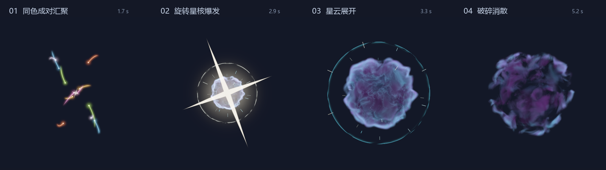

# 超新星汇聚 · 工程预制

面向 **VSCode GLSL Canvas / WebGL 1 / GLSL ES 1.00** 的自包含着色器。效果由程序化三维曲线和体积密度生成，不使用任何贴图；当前阶段只用于审查，不接入 Minecraft。



[查看完整循环动画](review.gif)。此 GIF 是原型的离屏渲染记录，图片和动画仅用于说明，着色器不会读取它们。

## 直接在 GLSL Canvas 中审查

1. 打开本目录的 `main.frag`。
2. 在命令面板执行 **Show glslCanvas**（`circledev.glsl-canvas`）。
3. 默认种子为 `17`，爆炸倒计时 `2.8` 秒，完整循环 `6.4` 秒。鼠标横向控制环绕角，纵向控制俯仰；没有鼠标输入时使用固定视角。
4. 修改顶部 `DEFAULT_SEED` 可比较不同实例，保存后刷新。种子应使用 `0–9999` 的整数。
5. 修改 `DEFAULT_EXPLOSION_TIME` 设置从本轮开始到爆炸的秒数，范围 `0.5–12`。爆炸时刻固定，粒子按剩余时间倒排；完整循环自动延长为倒计时加 `3.6` 秒。

入口直接使用 `u_time`、`u_resolution`、`u_mouse`。无需配置附加 uniform、纹理或预处理器；只有独立审查页会定义 `REVIEW_HOST` 并启用额外控制。

## 可暂停和逐帧的本地审查页

在项目根目录执行：

```powershell
.\shaderDev\SuperNovaConvergence\serve.ps1
```

然后打开 <http://127.0.0.1:8766/SuperNovaConvergence/preview.html>。服务只绑定本机，关闭进程或按 `Ctrl+C` 即可结束；端口被占用时可传入 `-Port 8767`。脚本优先使用已有 Python，也支持本机 Codex 自带的 Python，不安装依赖。

也可直接双击 `preview.html`，再通过右侧文件选择器载入同目录的 `main.frag`。由于浏览器限制，直接打开 HTML 时不能自动读取邻近文件。

- **暂停、逐帧、时间轴**：精确检查开始、阶段交界和结束。逐帧步长为 `1/60` 秒。
- **爆炸倒计时（秒）**：设置从本轮开始到爆炸的时间，默认 `2.8` 秒，范围 `0.5–12`。输入完成并离开输入框后生效；时间轴长度和阶段跳转随之更新。更改倒计时时保留当前阶段的相对进度，爆发后的翻卷和消散仍使用固定秒数。
- **爆炸前一帧 / 爆炸时刻**：直接定位到所设时刻的前 `1/60` 秒或后 `25 ms`。
- **种子**：控制每对粒子的曲线路径、纵深、倾角、提前抵达间隔、云团形态和外射碎片。每对同色、同步、关于爆心中心对称；种子不改变设定的爆炸时刻。暂停时换种子不会重置时间。
- **拖动 / 视角滑条**：检查球体纵深。双击画面恢复默认角度。
- **网格、背景、曝光**：检查空间关系、暗部与亮边。网格仅作参照。
- **32 / 56 / 80 步**：比较体积采样质量；默认 56 步。预览页同时限制渲染分辨率，减轻高 DPI 屏幕负担。
- **重新载入**：读取刚保存的 `main.frag`；编译失败时显示错误并保留上一版程序。
- **保存 PNG / 复制审查链接**：记录当前帧，链接保留时间、爆炸倒计时、种子、视角、曝光、背景、网格和精度。链接仅在运行本地服务的电脑上有效。

浏览器审查页与 GLSL Canvas 共用 `main.frag`，没有另一份效果实现。`preview.js` 只负责界面、时间和 uniform。

## 从参考 GIF 提取的节奏

参考图共 20 帧，每帧 70 ms，总长 1.4 秒：

| 参考阶段 | 原型中的处理 |
| --- | --- |
| 小星核与多色粒子出现 | 中央有限十字星，七种颜色各两颗粒子从相反方向成对出现 |
| 弯曲粒子流向中心收束 | 显式起点、两个控制点和终点的三维贝塞尔轨迹；粒子逐渐加速 |
| 最后粒子进入、星核受激 | 先设定爆炸时刻，再由剩余时间安排七对粒子；最后一对在倒计时归零时抵达，星核随汇入平滑旋转 |
| 云团急速向外炸开 | 短促十字爆闪、断续球面冲击前沿、向外飞散的有限碎片 |
| 紫色云团翻卷与消散 | 三维噪声球状云层、青紫卷边、内部空腔增长和密度破碎 |

默认将循环放慢至 6.4 秒供审查；选择“≈ GIF 原速”可将完整循环压缩到约 1.4 秒。两者阶段比例经过重新编排，并非逐帧复刻参考。

默认在第 `2.8` 秒爆炸，最后一对粒子恰好在此时抵达。爆发后约 `0.4` 秒完成主要膨胀，之后翻卷、缓慢扩张，至爆发后 `3.1` 秒完全消散，留出循环空档。

## 三维实现与函数边界

- `pairSchedule`：输入爆炸倒计时，返回每对粒子出生和抵达时剩余的秒数。位置由当前剩余时间直接求得。宿主只传入设定的 `u_explosion_time`，不计算粒子何时触发爆炸。
- `particlePath / bezier`：轨迹生成在三维空间中；每对拥有各自的纵深和弯曲，另一颗由起点和两个控制点关于爆心反射得到，再使用相同的种子旋转。终点显式为爆心。三维对称经过透视投影后，远近侧的屏幕长度允许不同。
- `convergence`：透视投影粒子和有限尾迹；尾迹只保留近期移动窗口，抵达前收缩到头部。点状光芒面向观察者，轨迹本身保持三维位置。
- `centralStar / star`：吸收每对粒子时累积平滑角位移。初始和爆发共用一颗星核及连续角度；横纵星臂先做距离场并集，再以一次覆盖率和预乘颜色合成，消除中心重复叠加的色块。
- `cloudSample / integrateCloud`：射线与球形包围域求交后进行体积积分。云形由局部三维噪声决定，颜色中的掠射亮度随视角变化；改变相机不会重新生成云形。
- `shockFront`：通过内外球壳弦长计算短促掠射亮边，颜色和断口由生命周期与三维噪声调制。
- `burstSparks`：外射碎片的头尾都在扩张前沿附近，远侧亮度衰减；没有从爆心延伸到无限远的射线。
- `previewBackground`：独立的背景和参考网格。

随机种子在一个实例的整个生命周期中固定，不使用逐帧随机数。采样位置只有幅度很小、随时间固定的像素抖动，用于减弱体积条带。

参考图的中央镂空没有直接复制成面向屏幕的洞。原型的空腔是径向三维空间，视线仍可能看见球壳后侧，旋转视角时不会退化为贴在屏幕上的圆环。

## 兼容性与已完成检查

2026-09-10 使用本机已有 ANGLE 图形库完成离屏 GLSL ES 1.00 编译、链接和像素渲染；默认入口与审查页宏入口均通过，绘制后无 GL 错误。本次修改检查了默认完整循环 64 帧、种子 `17 / 803 / 9999`、`0.5 / 2.8 / 12` 秒倒计时、宽屏、32 / 56 / 80 步采样；前版还检查过竖屏和不同俯仰与侧视角。`review.png` 与 `review.gif` 来自实际着色器输出。

另外检查了全部 `0–9999` 种子与 `0.5 / 1 / 2.8 / 6 / 12` 秒倒计时的组合：飞行时间均为正，同色成对同步，最后一对恰好在设定时刻抵达，云团都在下一循环前完全消散。默认种子 64 帧的画布边缘均无残留发光，循环首尾背景一致。

审查页 JavaScript 通过语法检查，实际浏览器页面已通过 WebGL 1 编译并成功显示；VSCode 插件界面未单独验收。离屏结果不能替代浏览器性能测试。高 DPI、大尺寸画布或同时预览多个体积效果时，可先选择草稿精度。

使用固定上限循环，不声明 `sampler`，不使用纹理采样、导数、动态数组、位运算或外部 GLSL include。需要片元 `highp` 精度，目标为桌面预览环境。

## 后续迁移边界

本轮只交付预制，审查通过后再决定游戏内实现：

1. 将秒制 `u_time` 换为每个爆炸实体自己的年龄，而非直接循环全局 `GameTime`；若接入项目的 tick uniform，需要除以 20 转成秒。
2. 以事件或实体数据同步种子、爆心、旋转、起始时间和爆炸倒计时。爆炸时间由事件数据决定，粒子只根据剩余寿命表现汇聚，不能反向延迟爆炸。
3. 粒子轨迹建议由 Java 生成有限带状网格，星芒使用 billboard；体积云使用球体代理或深度感知的体积渲染。
4. 预制中的透视和网格由正式相机、模型矩阵及场景深度替代。远侧碎片目前采用亮度近似，不等于完整深度遮挡。
5. 当前输出为带背景、已色调映射的不透明画面；正式渲染须拆分体积颜色/透射率和加法光，统一深度、颜色空间和混合方式，不能直接使用当前 `gl_FragColor.a = 1.0`。
6. 依照目标 Minecraft shader 的 JSON 与顶点格式改为 GLSL 150，并按项目规范注册、获取和重载 ShaderInstance。

参考网格没有实现与地形的碰撞、残留或深度合成。这些应由移植阶段结合实际渲染管线设计。
